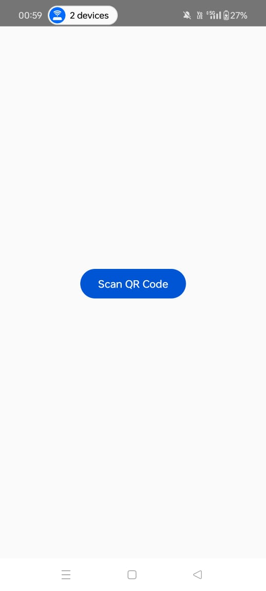
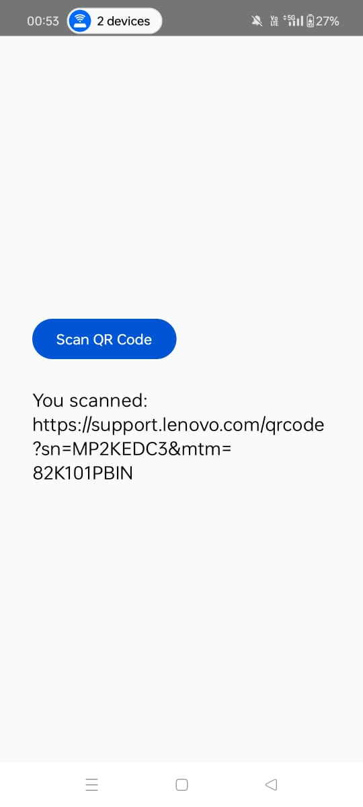

# 📱 QR Code Scanner App

A modern Android app built using Jetpack Compose and CameraX that allows users to scan QR codes easily. When a valid URL is scanned, the app automatically opens it in the browser, providing a seamless user experience.

---

## 🔥 Features

- 📷 **Scan QR Codes** using your phone's camera
- 🔗 **Automatic Redirection** to scanned URLs
- 🖼️ **Intuitive UI** with a clean home screen and real-time camera preview
- 🎨 **Compose-based UI** with light-themed background and responsive design
- 🔐 **Permission Handling** for camera access

---

## 📸 Screenshots

### 🏠 Home Screen


### 🔍 QR Code Scanner


---

## 🚀 Getting Started

1. Clone the repository  
   ```bash
   git clone https://github.com/yourusername/qrcode-scanner-app.git

2. Open in Android Studio

3. Run the app on a device or emulator with a camera


> Make sure to allow camera permissions when prompted


## 🛠️ Tech Stack

  1. Kotlin

  2. Jetpack Compose

  3. CameraX

  4. ML Kit Barcode Scanning

  5. Material3

## 🧠 Future Improvements

  1. History of scanned QR codes

  2. Dark mode support

  3. Flash toggle for low-light conditions
